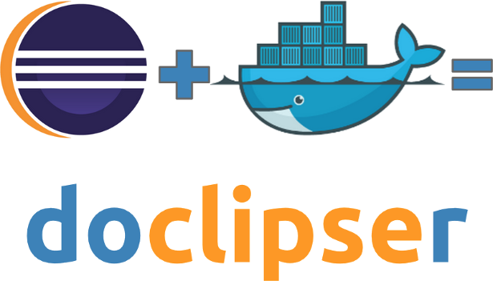
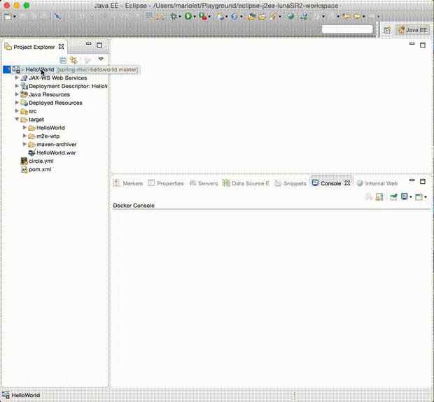

#### Edit, build, run Docker containers from Eclipse [](https://circleci.com/gh/domeide/doclipser) [  ](https://dl.bintray.com/zenika/doclipser/)




## Features


Currently supported features are:
* Dockerfile syntax highlighting and autocomplete
* Support for the following Docker commands: `build`, `run`, `ps`, `logs`, `rm`

Even if this is still a working progress project, we believe some people can still find it useful.
We plan to provide support for Docker compose yml files too (and therefore volumes and links). 

Although this plugin focus on running containers through the support of Dockerfiles and Compose yml files in eclipse, there is another interesting project from JBoss that has a slightly different approach : it provides a more advanced management of Docker images and containers without Dockerfiles support : http://tools.jboss.org/blog/2015-03-30-Eclipse_Docker_Tooling.html.

## Installation

Plugin Update site: https://dl.bintray.com/zenika/doclipser

##### To install the plugin follow the usual Eclipse plugin install procedure:

###### 1. Start Eclipse
Select Help > Install New Software... In the dialog that appears, enter the update site URL into the "Work with" text box: https://dl.bintray.com/zenika/doclipser
And press the enter key.

###### 2. Select the checkbock next to the component you want to install and click Next.

###### 3. Review the features that you are about to install. Click Next.

###### 4. Read the license agreements and then select I accept the terms of the license agreements. Click Finish.

###### 5. Click OK on the Security Warning.

###### 6. You will then be asked if you would like to restart Eclipse. Click Restart Now.

## Configuration

In order to run Docker commands doclipser need to be configured to connect to a running Docker engine. 

#### On Linux
Just make sure you can run Docker without sudo (i.e. [user belongs to docker group](https://docs.docker.com/installation/ubuntulinux/#create-a-docker-group))

#### On MacOS or Windows (or when Docker is on a remote host)
Edit doclipser configuration file: `<Eclipse Install Directory>/plugins/com.zenika.doclipser.api_<Version>/docker.properties`. You will need to set `docker.api.uri` and `docker.api.cert.path` properties

## Contributing

#### Prerequisites
1. JDK 7 or above
2. Maven 3
3. [Eclipse Modeling Tools](https://www.eclipse.org/downloads/packages/eclipse-modeling-tools/lunasr2) with the following plugins :
   * m2e - Maven Integration for Eclipse
   * Xtext Complete SDK
   * E4 Tools (optional)

#### Workflow
1. Fork it!
2. Create your feature branch: `git checkout -b my-new-feature`
3. Build the project once to generate java code from xtext dsl definition:
   ``` bash
   cd com.zenika.doclipser.parent/ &&  export MAVEN_OPTS="-Xmx512m -XX:MaxPermSize=128m" && mvn clean install
   ```
4. Import the projects into eclipse as Existing Maven Projects 
5. To test and debug go to Run Configurations, select RunDoclipser and Run  
3. Commit your changes: `git commit -am 'Add some feature'`
4. Push to the branch: `git push origin my-new-feature`
5. Submit a pull request :D

## Credits
* [Spotify Java Docker API](https://github.com/spotify/docker-client)
* [Xtext](https://eclipse.org/Xtext/) framework for the Dockerfile grammar definition
* [BinTray distribution service](http://bintray.com)
* [Zenika](http://zenika.com)

## License
[Eclipse Public License v1.0](https://www.eclipse.org/legal/epl-v10.html)
