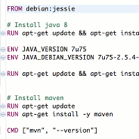
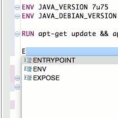

#### Edit, build, run Docker containers from Eclipse  

##### Dockerfile Syntax Highlighting

##### Dockerfile Auto Complete

##### Execute Docker commands

## Installation

#### Direct plugin link: 

#### Detailed install procedure:

##### 1. Start Eclipse
Select Help > Install New Software... In the dialog that appears, enter the update site URL into the "Work with" text box: https://dl.bintray.com/zenika/doclipser
And press the enter key.

##### 2. Select the checkbock next to the component you want to install and click Next.

##### 3. Review the features that you are about to install. Click Next.

##### 4. Read the license agreements and then select I accept the terms of the license agreements. Click Finish.

##### 5. Click OK on the Security Warning.

##### 6. You will then be asked if you would like to restart Eclipse. Click Restart Now.

## Configuration

## Contributing

#### Prerequisites
1. JDK 7 or above
2. Maven 3
3. [Eclipse Modeling Tools](https://www.eclipse.org/downloads/packages/eclipse-modeling-tools/lunasr2) with the following plugins :
   * m2e - Maven Integration for Eclipse
   * Xtext Complete SDK
   * E4 Tools (optional)

#### Workflow
1. Fork it!
2. Create your feature branch: `git checkout -b my-new-feature`
3. Build the project once to generate java code from xtext dsl definition: `cd com.zenika.docker.parent/ && mvn clean install`
4. Import the projects into eclipse as Existing Maven Projects 
5. To test and debug go to Run Configurations, select RunDoclipser and Run  
3. Commit your changes: `git commit -am 'Add some feature'`
4. Push to the branch: `git push origin my-new-feature`
5. Submit a pull request :D

## Credits
* [Spotify Java Docker API](https://github.com/spotify/docker-client)
* [Xtext](https://eclipse.org/Xtext/) framework for the Dockerfile grammar definition
* [BinTray distribution service](http://bintray.com)
* [Docker](http://docker.com)
* [Zenika](http://zenika.com)

## License
[Eclipse Public License v1.0](https://www.eclipse.org/legal/epl-v10.html)
